# Odoobo-Expert Architecture Diagrams

Visual representations of the local-first development architecture.

---

## System Architecture Overview

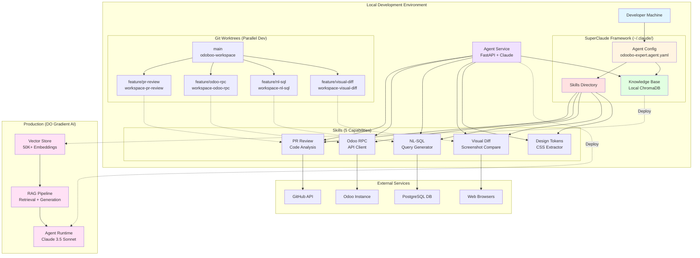

---

## Skill Architecture

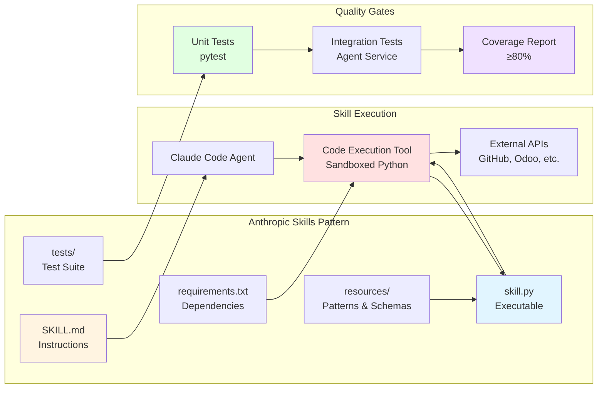

---

## Git Worktrees Development Flow

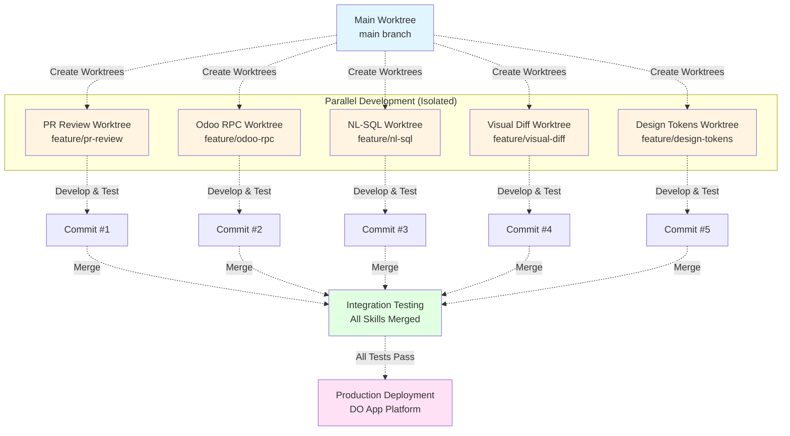

---

## Knowledge Base Architecture

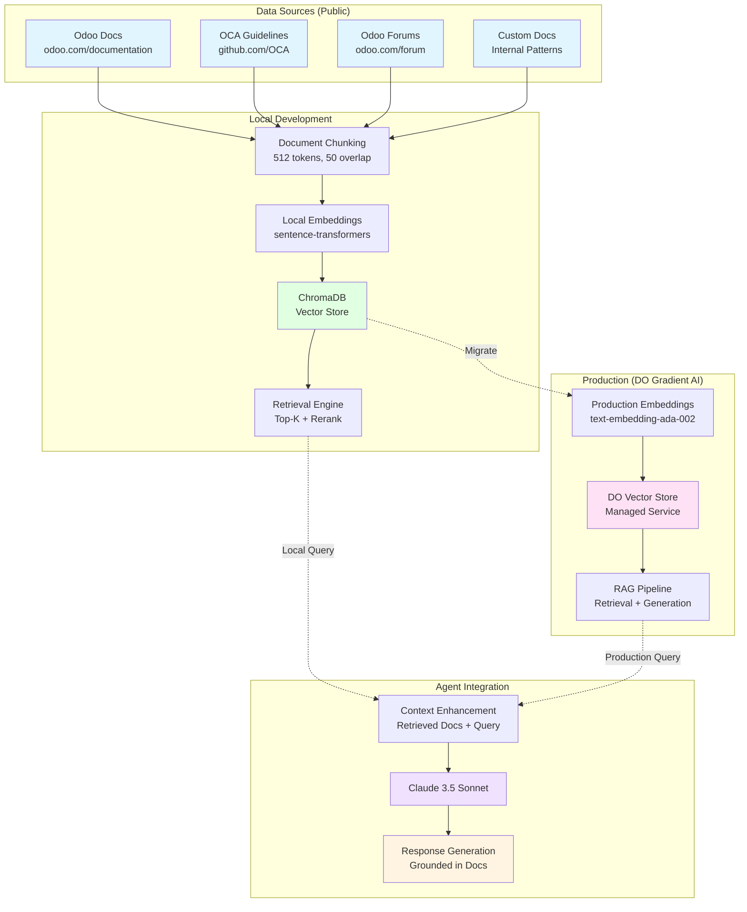

---

## Development Workflow Timeline

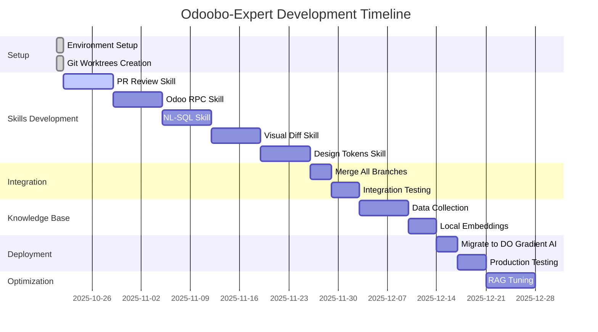

---

## Skill Execution Flow

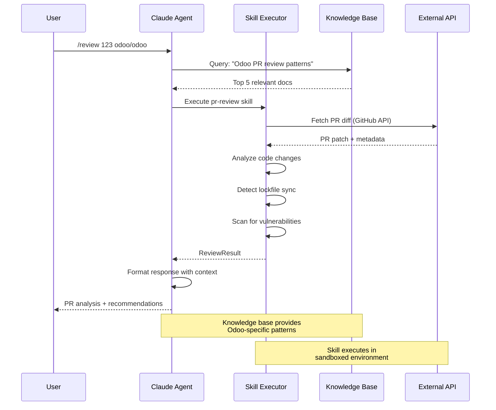

---

## Cost Optimization Strategy

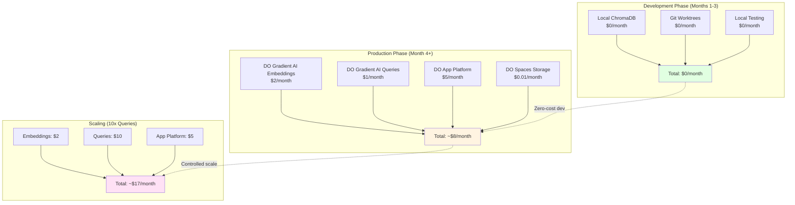

---

## Skill Composition Patterns

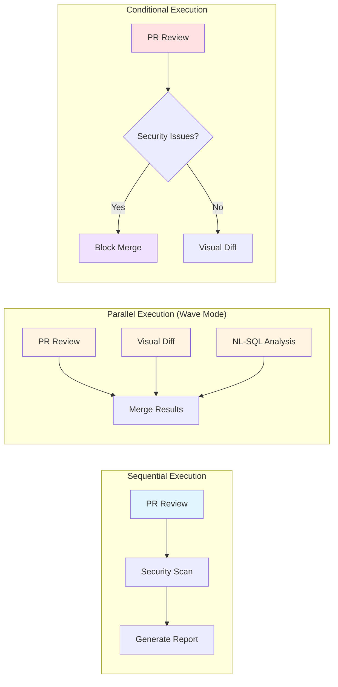

---

## Deployment Architecture

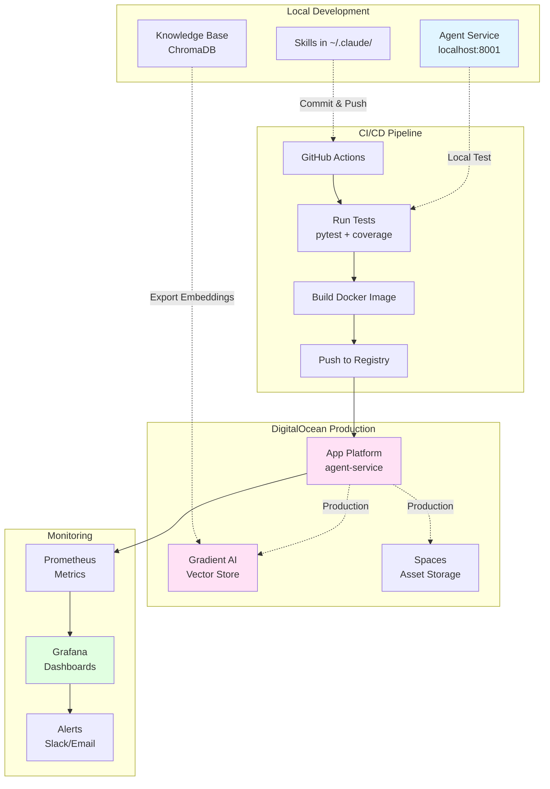

---

## Performance Targets

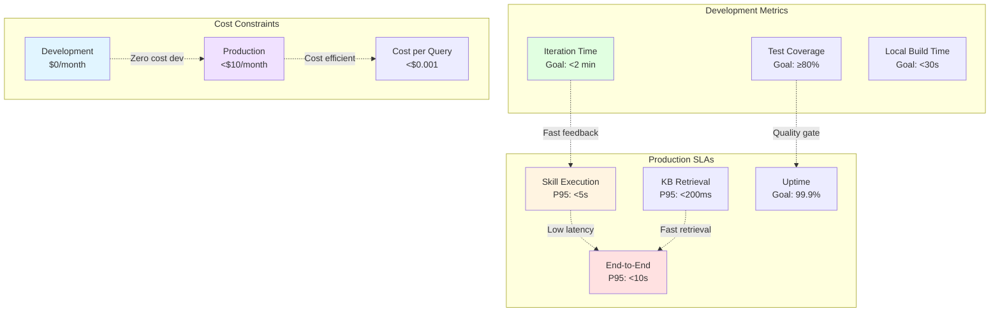

---

## Security Architecture

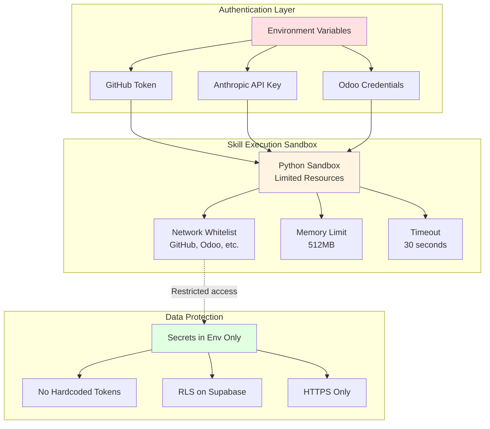

---

## Notes

**Legend**:

- **Blue boxes**: Configuration/Setup
- **Yellow boxes**: Active processes
- **Green boxes**: Success states
- **Red boxes**: Error/Block states
- **Pink boxes**: Production environment

**Diagram Tools**:

- Rendered with Mermaid.js
- View in GitHub, VS Code, or https://mermaid.live/

**Updates**:

- Architecture finalized: 2025-10-21
- Next review: After Phase 1 completion (Week 2)
