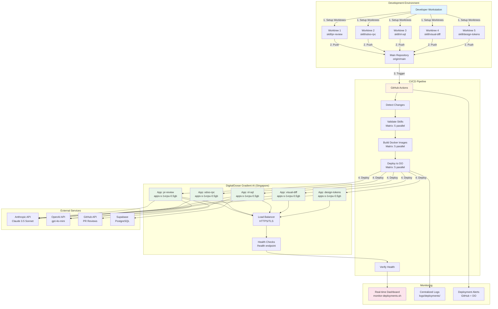

# Deployment Architecture - Parallel Skill Deployment

## System Overview



## Deployment Flow

### Phase 1: Worktree Setup

```
Developer Workstation
    │
    ├─→ ./scripts/setup-worktrees.sh
    │
    ├─→ Create 5 Branches
    │   ├─ skill/pr-review
    │   ├─ skill/odoo-rpc
    │   ├─ skill/nl-sql
    │   ├─ skill/visual-diff
    │   └─ skill/design-tokens
    │
    └─→ Initialize Worktrees
        ├─ /tmp/odoobo-worktrees/pr-review/
        ├─ /tmp/odoobo-worktrees/odoo-rpc/
        ├─ /tmp/odoobo-worktrees/nl-sql/
        ├─ /tmp/odoobo-worktrees/visual-diff/
        └─ /tmp/odoobo-worktrees/design-tokens/
```

### Phase 2: Parallel Development

```
Worktree 1 (pr-review)      Worktree 2 (odoo-rpc)      ...
    │                            │
    ├─ Develop skill             ├─ Develop skill
    ├─ Test locally              ├─ Test locally
    ├─ Commit changes            ├─ Commit changes
    └─ Push to branch            └─ Push to branch
         │                            │
         └────────┬───────────────────┘
                  │
                  ▼
          GitHub Actions
```

### Phase 3: CI/CD Pipeline (Matrix Strategy)

```
GitHub Actions Workflow
    │
    ├─→ Job 1: Detect Changes
    │   └─ Identify modified skills
    │
    ├─→ Job 2: Validate Skills (5 parallel)
    │   ├─ [pr-review]    Lint + Test + Structure Check
    │   ├─ [odoo-rpc]     Lint + Test + Structure Check
    │   ├─ [nl-sql]       Lint + Test + Structure Check
    │   ├─ [visual-diff]  Lint + Test + Structure Check
    │   └─ [design-tokens] Lint + Test + Structure Check
    │
    ├─→ Job 3: Build Skills (5 parallel)
    │   ├─ [pr-review]    Docker build + Container test
    │   ├─ [odoo-rpc]     Docker build + Container test
    │   ├─ [nl-sql]       Docker build + Container test
    │   ├─ [visual-diff]  Docker build + Container test
    │   └─ [design-tokens] Docker build + Container test
    │
    ├─→ Job 4: Deploy Skills (5 parallel)
    │   ├─ [pr-review]    doctl apps create/update
    │   ├─ [odoo-rpc]     doctl apps create/update
    │   ├─ [nl-sql]       doctl apps create/update
    │   ├─ [visual-diff]  doctl apps create/update
    │   └─ [design-tokens] doctl apps create/update
    │
    └─→ Job 5: Verify Health (sequential)
        └─ Test all /health endpoints
```

### Phase 4: Production Deployment

```
DigitalOcean App Platform (Singapore sgp)
    │
    ├─→ App 1: odoobo-skill-pr-review
    │   ├─ Instance: apps-s-1vcpu-0.5gb
    │   ├─ Port: 8080
    │   ├─ Health: /health
    │   └─ URL: https://odoobo-skill-pr-review-{id}.ondigitalocean.app
    │
    ├─→ App 2: odoobo-skill-odoo-rpc
    ├─→ App 3: odoobo-skill-nl-sql
    ├─→ App 4: odoobo-skill-visual-diff
    └─→ App 5: odoobo-skill-design-tokens
         │
         └─→ Load Balancer + TLS Termination
              │
              └─→ Public Internet (HTTPS only)
```

## Data Flow

### Request Flow

```
Client Request
    │
    ├─→ HTTPS (TLS 1.3)
    │
    ├─→ DigitalOcean Load Balancer
    │
    ├─→ App Instance (Port 8080)
    │   ├─ FastAPI Application
    │   ├─ Skill Handler
    │   └─ Tool Functions
    │
    ├─→ External API Calls
    │   ├─ Anthropic API (Claude)
    │   ├─ OpenAI API (GPT-4o-mini)
    │   ├─ GitHub API (PR reviews)
    │   └─ Supabase (database)
    │
    └─→ Response (JSON)
```

### Health Check Flow

```
DigitalOcean Health Monitor
    │
    ├─→ Every 10 seconds
    │
    ├─→ HTTP GET /health
    │   ├─ Initial delay: 30s
    │   ├─ Timeout: 5s
    │   └─ Failure threshold: 3
    │
    ├─→ Response Check
    │   └─ HTTP 200 + {"status": "healthy"}
    │
    └─→ Action
        ├─ Success: Continue
        ├─ Failure (1-2): Retry
        └─ Failure (3+): Restart instance
```

## Monitoring Architecture

### Real-time Monitoring Dashboard

```
monitor-deployments.sh
    │
    ├─→ Query DO API (doctl)
    │   ├─ List all apps
    │   ├─ Get deployment status
    │   └─ Get app URLs
    │
    ├─→ Test Health Endpoints
    │   └─ curl -sf https://{app-url}/health
    │
    ├─→ Display Dashboard
    │   ├─ Skill name
    │   ├─ Deployment status (ACTIVE/PENDING/ERROR)
    │   ├─ Health status (✓/✗)
    │   └─ App URL
    │
    └─→ Refresh every 10 seconds
```

### Logging Infrastructure

```
Centralized Logging
    │
    ├─→ Deployment Logs
    │   ├─ logs/deployments/deploy-{timestamp}.log
    │   └─ logs/deployments/deploy-{timestamp}-{skill}.log
    │
    ├─→ Test Logs
    │   └─ logs/tests/test-{timestamp}.log
    │
    ├─→ Merge Logs
    │   └─ logs/merges/merge-{timestamp}.log
    │
    ├─→ Rollback Logs
    │   └─ logs/rollbacks/rollback-{timestamp}.log
    │
    └─→ App Runtime Logs
        └─ doctl apps logs {app-id} --type=run
```

## Network Architecture

### Network Topology

```
Internet (HTTPS)
    │
    ├─→ DigitalOcean Load Balancer (Port 443)
    │   ├─ TLS Termination
    │   └─ HTTP/2 Support
    │
    ├─→ App Instance 1 (pr-review)
    │   ├─ Internal IP: 10.x.x.1
    │   ├─ Port: 8080
    │   └─ Health: /health
    │
    ├─→ App Instance 2 (odoo-rpc)
    ├─→ App Instance 3 (nl-sql)
    ├─→ App Instance 4 (visual-diff)
    └─→ App Instance 5 (design-tokens)
         │
         └─→ Outbound Connections
             ├─ Anthropic API (api.anthropic.com:443)
             ├─ OpenAI API (api.openai.com:443)
             ├─ GitHub API (api.github.com:443)
             └─ Supabase (*.supabase.co:443)
```

### Security Layers

```
Layer 1: TLS/HTTPS
    └─ All traffic encrypted with TLS 1.3

Layer 2: Load Balancer
    ├─ DDoS protection
    ├─ Rate limiting
    └─ IP filtering (optional)

Layer 3: App Platform
    ├─ Container isolation
    ├─ Secret management (encrypted env vars)
    └─ Network policies

Layer 4: Application
    ├─ Input validation
    ├─ Authentication (API keys)
    └─ Rate limiting per endpoint
```

## Rollback Architecture

### Rollback Flow

```
Failed Deployment Detected
    │
    ├─→ Query Deployment History
    │   └─ doctl apps list-deployments {app-id}
    │
    ├─→ Identify Previous ACTIVE Deployment
    │   └─ Filter by Phase=ACTIVE, sort by CreatedAt
    │
    ├─→ Trigger Rollback
    │   └─ doctl apps create-deployment {app-id} --deployment-id {prev-id}
    │
    ├─→ Monitor Rollback Progress
    │   ├─ Wait for Phase=ACTIVE
    │   └─ Timeout: 10 minutes
    │
    ├─→ Verify Health
    │   └─ curl -sf https://{app-url}/health
    │
    └─→ Update Status
        └─ WORKTREE_STATUS.json: status=rolled_back
```

### Failure Scenarios

```
Scenario 1: Build Failure
    └─ Action: Stop deployment, log error, keep previous version running

Scenario 2: Deploy Failure
    └─ Action: Automatic rollback to previous ACTIVE deployment

Scenario 3: Health Check Failure
    └─ Action: Restart instance, retry 3 times, then rollback

Scenario 4: API Key Invalid
    └─ Action: Mark as configuration error, prevent deployment
```

## Performance Optimization

### Parallelization Strategy

```
Sequential Deployment (Traditional)
    Skill 1 → Skill 2 → Skill 3 → Skill 4 → Skill 5
    5-10 min × 5 = 25-50 minutes total

Parallel Deployment (This System)
    Skill 1 ↘
    Skill 2 → Deploy → Monitor → Verify
    Skill 3 ↗
    Skill 4 ↗
    Skill 5 ↗
    5-10 minutes total (80% time reduction)
```

### Resource Optimization

```
Git Worktrees
    ├─ Shared .git objects (disk space optimization)
    ├─ Independent working directories (no conflicts)
    └─ Parallel commits without branch switching

Background Processes
    ├─ Non-blocking deployment execution
    ├─ PID-based process management
    └─ Parallel log capture

GitHub Actions Matrix
    ├─ Native parallel job execution
    ├─ Independent runner allocation
    └─ Shared artifact storage
```

## Cost Architecture

### Monthly Cost Breakdown

```
Infrastructure Costs
    ├─ App 1 (pr-review):       $5-8/month
    ├─ App 2 (odoo-rpc):        $5-8/month
    ├─ App 3 (nl-sql):          $5-8/month
    ├─ App 4 (visual-diff):     $5-8/month
    └─ App 5 (design-tokens):   $5-8/month
    Total Infrastructure:        $25-40/month

API Usage Costs (Variable)
    ├─ Anthropic Claude:        $2-5/month per skill
    ├─ OpenAI GPT-4o-mini:      $1-3/month per skill
    └─ GitHub API:              Free (within limits)
    Total API Usage:             $10-20/month

Grand Total:                     $35-60/month

Compared to Previous Setup
    ├─ Azure (deprecated):       $100+/month
    └─ DO Droplet (previous):    $21-38/month + maintenance
```

### Scaling Economics

```
Traffic Level    Instance Size         Monthly Cost
─────────────────────────────────────────────────────
Low (< 1K req/m)  apps-s-1vcpu-0.5gb   $5-8
Medium (1K-10K)   apps-s-1vcpu-1gb     $10-15
High (10K-100K)   apps-s-2vcpu-4gb     $25-35
Enterprise        apps-s-4vcpu-8gb     $50-70

Auto-scaling: instance_count adjusts dynamically
Cost optimization: Scale down during off-hours
```

---

**Generated with Claude Code**
**DevOps Architect Persona**
**Last Updated**: 2025-10-21
